# Variational_Integrator_Networks (Work in Progress)

- [ ] Add HNN Baseline
- [ ] Sampling/Uncertainty predictions plots
- [ ] Documentation

## Ideal Pendulum: Noisy States

### Test setup: given initial state, forecast the evolution for 10s.

### 3s Training data

#### ResNet

  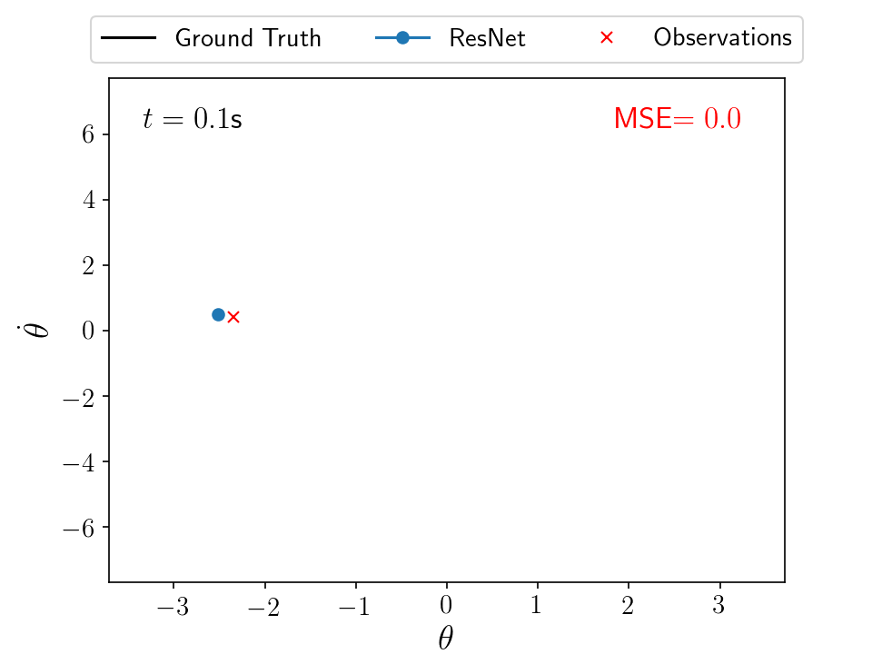
  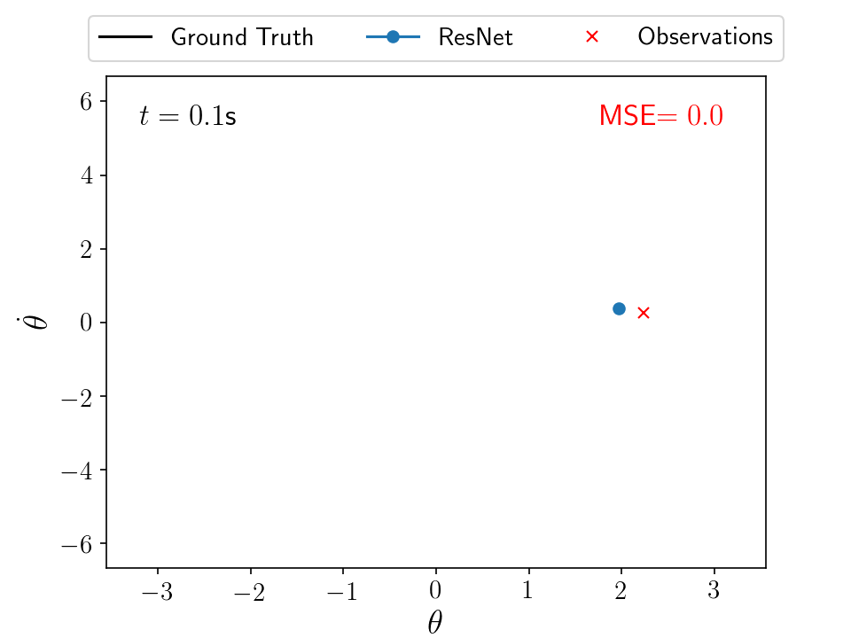 
  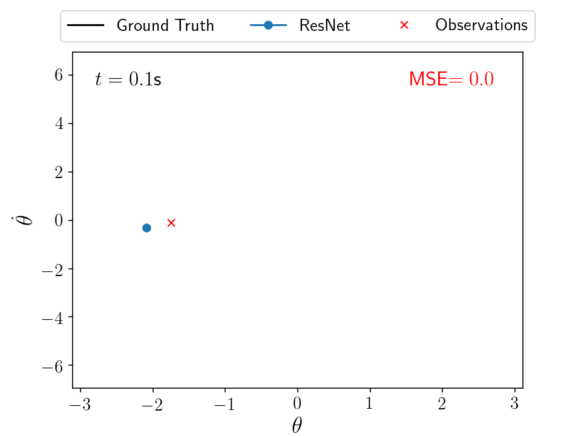

#### Variational Integrator Network (Velocity Verlet)

  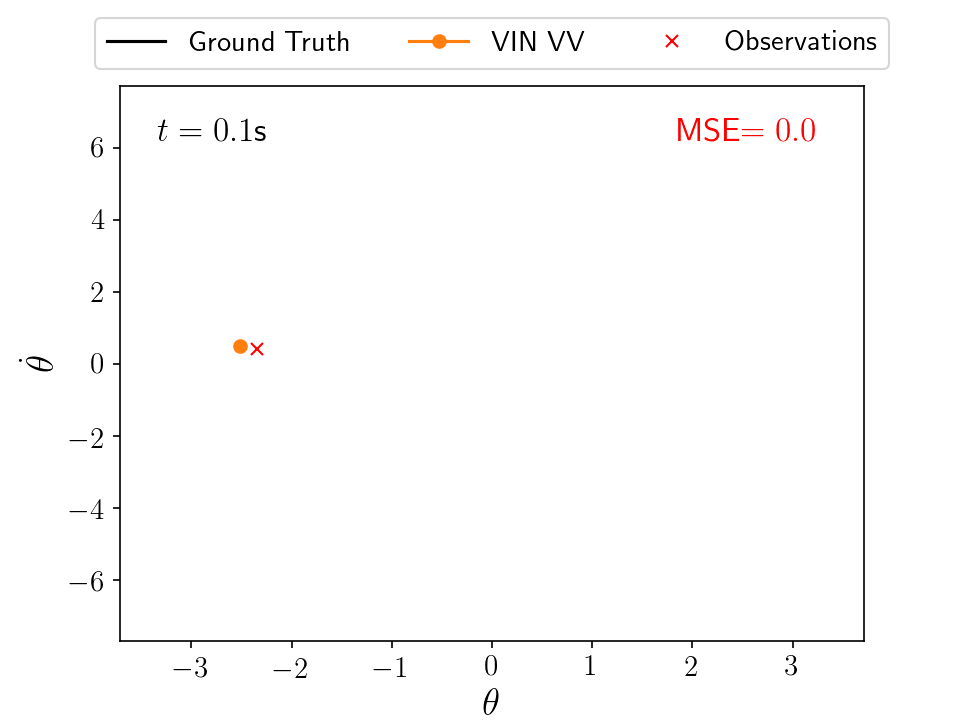
  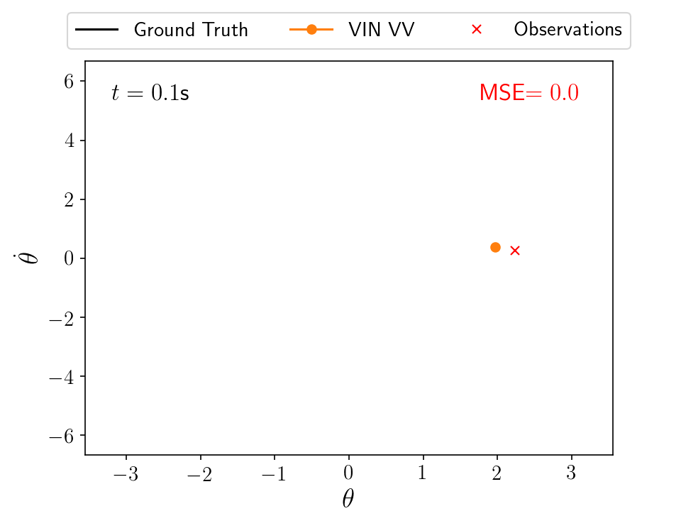 
  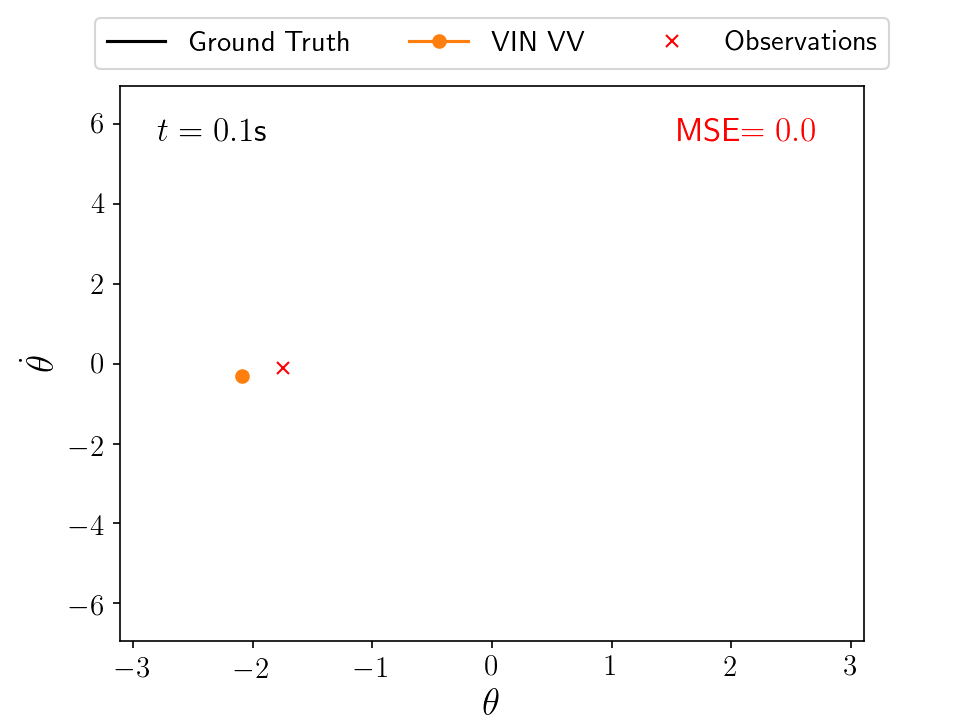

### 15s Training data

#### ResNet

  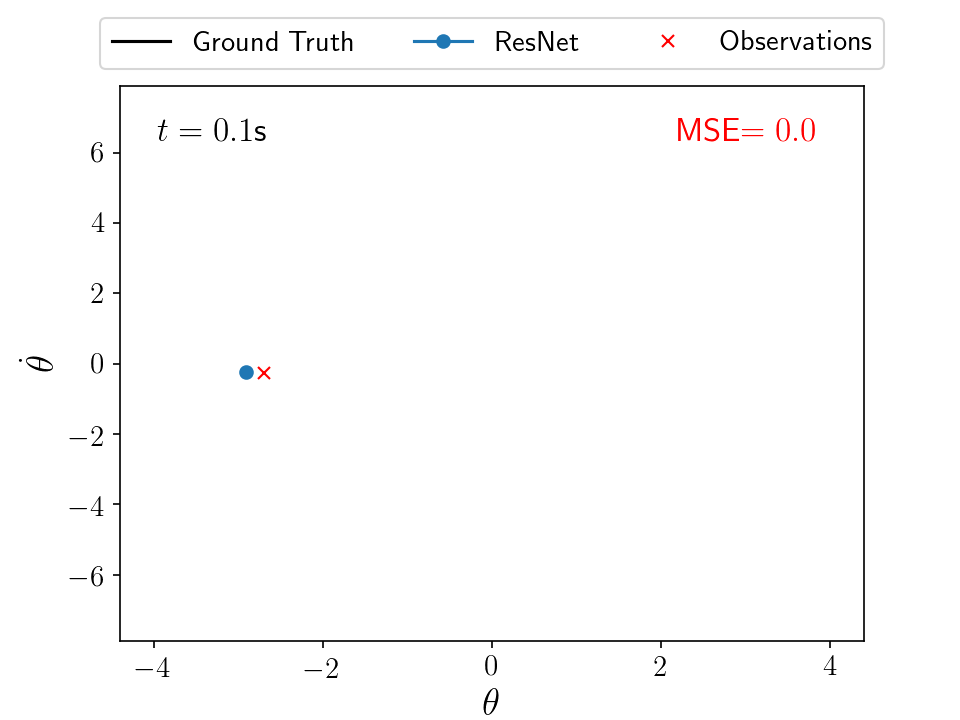
  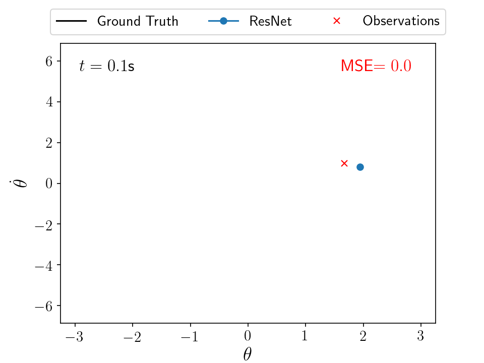 
  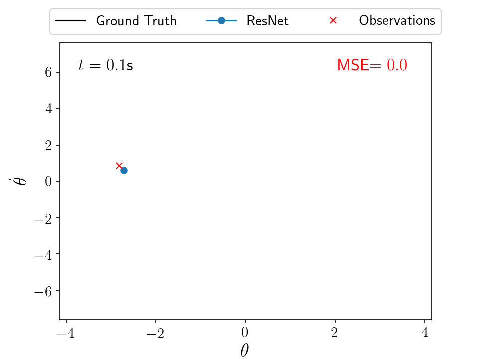

#### Variational Integrator Network (Velocity Verlet)

  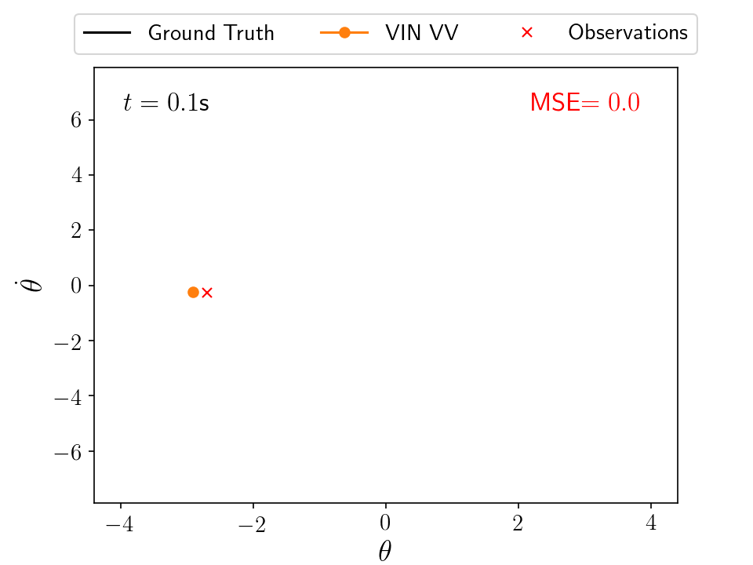
  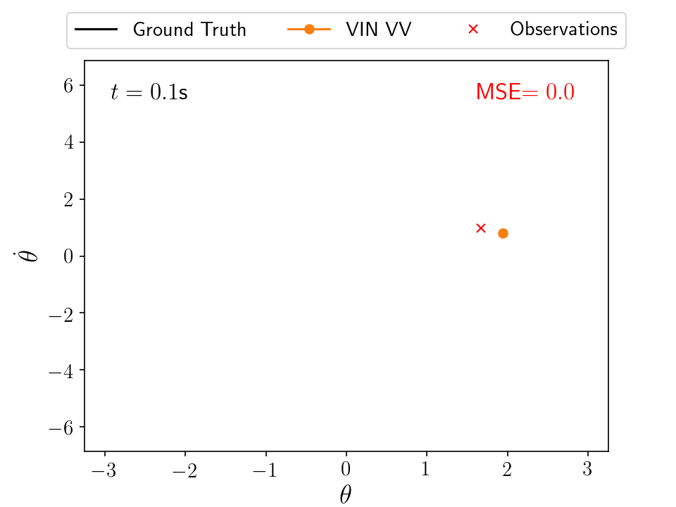 
  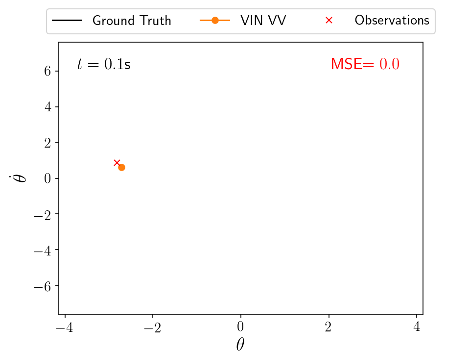

## Pixel Observations

### 6s Training data. Test setup: given initial image observations, forecast the evolution for 10s.

#### ResNet, VIN-SO2, VIN-VV

  
  
  

