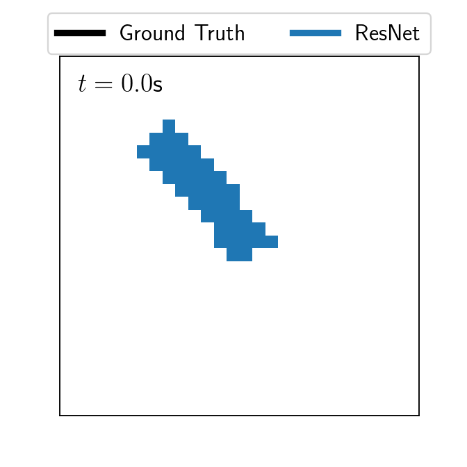
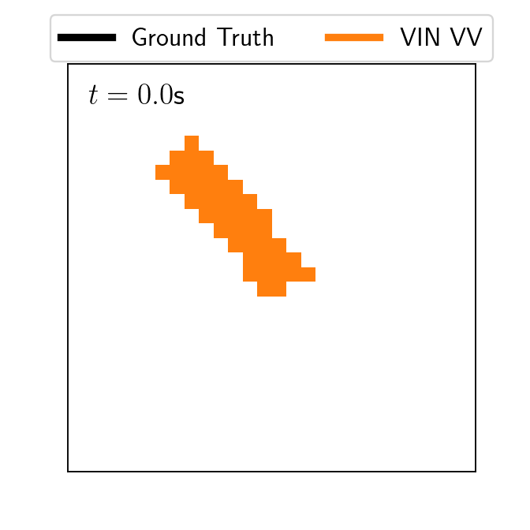
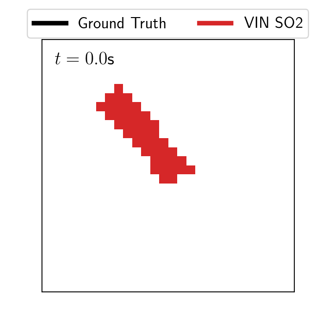

# Variational Integrator Networks

## Overview

### Link to paper

### Run experiment
`python run_exp.py root_dir model_name system_name observations num_train_traj num_train_steps seed` 
e.g.  
`python run_exp.py experiments VIN_VV pendulum pixels 1 60 1`

### Dependencies
- tensorflow 2.1
- tensorflow_probability
- gin-config
- see `requirements.txt`

## Example: Ideal Pendulum, Noisy Observations

__Setup__
- Train on 15s of observations (150 datapoints)
- Test on noisless initial state, forecast for 10s

  
  

#### Recurrent Residual Network (Left) / Variational Integrator Network (Right) 

## Example: Ideal Pendulum, Pixel Observations

__Setup__
- Train on 6s of 28x28 pixel observations (60 datapoints)
- Infer latent initial state from 1s of data
- Forecast for 10s, reconstruct latent path

#### Recurrent ResNet (Left) / VIN (Middle) / VIN on SO(2) Manifold (Right)